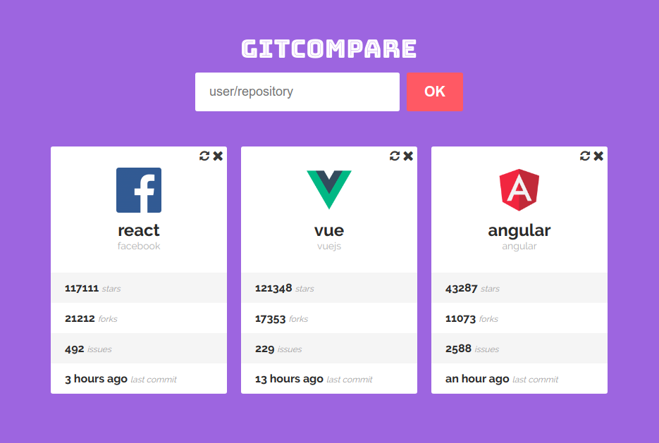

# gitcompare

> React app to compare stats from Github repositories.

I used React and the following libraries to develop **gitcompare**:

- [Axios](https://github.com/axios/axios)
- [Moment](https://momentjs.com/)
- [Font-awesome](https://fontawesome.com/)
- [Styled-components](https://www.styled-components.com/)

[**Demo available here!**](http://gitcompare.surge.sh)

<p align="center">
  
</p>

## Using

First of all, you need to clone or download this repository.

```
git clone https://github.com/viniciusmeneses/gitcompare.git
```

Go to the **gitcompare** folder and install the dependencies

```
npm install
```

Run one of the following commands to start use locally **gitcompare**:

```
// Starts development webserver
npm start

// Builds the application to production
npm run build
```
